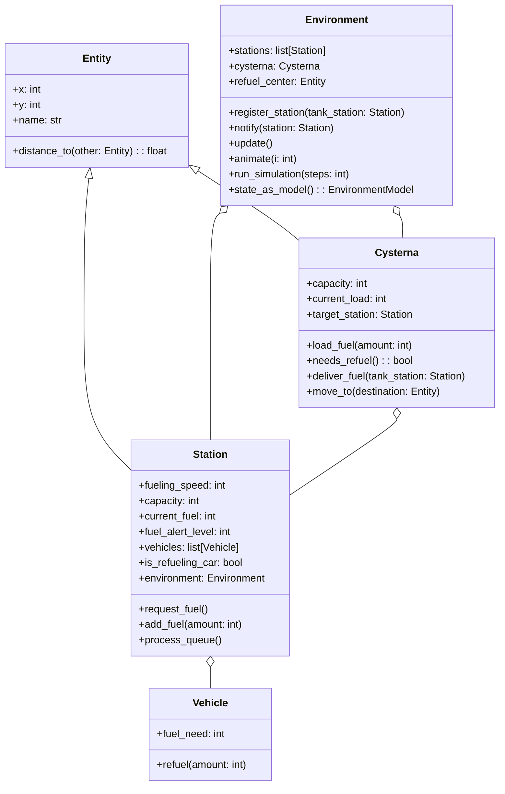

### Symulator Stacji Paliw

### Formalny opis symulacji tankowania na stacji paliw

**Przegląd:**

Symulacja tankowania na stacji paliw modeluje dynamiczny system obejmujący wiele stacji paliw, centralne centrum tankowania oraz cysternę zarządzającą dystrybucją paliwa. Symulacja ma na celu optymalizację logistyki paliwowej poprzez zapewnienie, że każda stacja utrzymuje odpowiedni poziom paliwa w celu efektywnej obsługi przyjeżdżających pojazdów, minimalizując jednocześnie straty związane z brakiem paliwa na stacjach.

**Komponenty Symulacji:**

1. **Stacje Paliw:**
   - Każda stacja charakteryzuje się swoimi współrzędnymi geograficznymi i określoną pojemnością paliwa.
   - Stacje mają kolejkę pojazdów, z których każdy wymaga określonej ilości paliwa.
   - Stacje monitorują swoje poziomy paliwa i wysyłają prośby o tankowanie do cysterny, gdy poziom paliwa spadnie poniżej określonego progu.

2. **Cysterna:**
   - Zadaniem cysterny jest tankowanie stacji z centralnego centrum tankowania.
   - Ma ograniczoną pojemność paliwa i musi wrócić do centrum tankowania, aby uzupełnić swoje zapasy paliwa, szczególnie gdy jej ładunek spadnie poniżej 20% swojej pojemności.
   - Cysterna podąża za wyznaczoną trasą, aby efektywnie dostarczać paliwo do stacji, które tego potrzebują. Może obsługiwać tylko jedną stację na raz i ignoruje nowe żądania w trakcie podróży.

3. **Centrum Tankowania:**
   - Położone centralnie w obszarze symulacji, centrum tankowania utrzymuje nieskończone zapasy paliwa.
   - Służy jako główne źródło, z którego cysterna uzupełnia swój ładunek paliwa.

**Dynamika Operacyjna:**

- Symulacja postępuje w dyskretnych krokach. Każdy krok obejmuje ruch cysterny w kierunku celu, dostarczanie paliwa lub powrót do centrum tankowania w celu tankowania.
- Stacje paliw ciągle przetwarzają swoje kolejki pojazdów, dostarczając paliwo pojazdom w zależności od dostępności i priorytetu kolejki.
- Po osiągnięciu krytycznych poziomów paliwa, stacje wysyłają żądanie tankowania do cysterny. Jeśli cysterna jest dostępna (nie obsługuje innej stacji lub nie jest w trasie), ustawi żądającą stację jako swój następny cel.
- Jeśli ładunek paliwa cysterny jest krytycznie niski, priorytetem jest powrót do centrum tankowania zamiast odpowiadania na żądania stacji.

**Cel:**

Głównym celem symulacji jest efektywne zarządzanie logistyką paliwową. Obejmuje to:
- Minimalizację czasu oczekiwania pojazdów na stacjach paliw.
- Redukcję strat związanych z brakiem paliwa na stacjach, co pozwala na ciągłość usług.
- Zapewnienie, że żadna stacja nie wyczerpie paliwa, co mogłoby zakłócić obsługę i wpłynąć na zadowolenie klientów.

**Metryki Oceny:**

- Średni czas oczekiwania na pojazd na wszystkich stacjach.
- Łączna ilość dostarczonego paliwa przez cysternę w porównaniu z ilością paliwa zu

żytego na podróże i powroty do centrum tankowania.
- Częstotliwość wyczerpywania się paliwa na stacjach.

Ta symulacja dostarcza cennych wglądów w logistykę zarządzania paliwem w kontrolowanym środowisku, umożliwiając strategiczne planowanie i operacyjne dostosowania w celu zwiększenia efektywności rzeczywistych sieci dystrybucji paliw.

## Architektura

Aby lepiej sformalizować symulację stacji paliw, możemy wprowadzić kilka matematycznych modeli, które będą opisywać zachowanie poszczególnych komponentów symulacji oraz ich interakcje. Oto propozycja wzorów i modeli, które mogą być użyteczne:

### Model Matematyczny Symulacji Stacji Paliw

1. **Model Ruchu Cysterny:**
   - Prędkość przemieszczania się cysterny $v$ oraz odległość $d$ między cysterną a stacją są kluczowe dla obliczenia czasu podróży $t$, który jest potrzebny, aby dotrzeć do stacji.
   $$ 
   t = \frac{d}{v}
   $$ 
   gdzie $d$ jest obliczane jako odległość euklidesowa między cysterną a stacją:
   $$ 
   d = \sqrt{(x_2 - x_1)^2 + (y_2 - y_1)^2}
   $$ 
   gdzie $(x_1, y_1)$ to współrzędne cysterny, a $(x_2, y_2)$ to współrzędne stacji.

2. **Model Zużycia Paliwa przez Cysternę:**
   - Zużycie paliwa przez cysternę jest funkcją odległości $d$ i stałej zużycia paliwa $k$:
   $$ 
   P = k \cdot d
   $$ 
   gdzie $k$ jest stałą zużycia paliwa na jednostkę odległości.

3. **Model Procesu Tankowania na Stacji:**
   - Gdy cysterna dotrze na stację, ilość dostarczonego paliwa $f_d$ jest ograniczona przez ilość paliwa w cysternie $f_c$ oraz zapotrzebowanie stacji $f_s$:
   $$ 
   f_d = \min(f_c, f_s)
   $$ 
   gdzie $f_s$ to zapotrzebowanie stacji na paliwo, które jest różnicą między pojemnością stacji a aktualnym poziomem paliwa.

