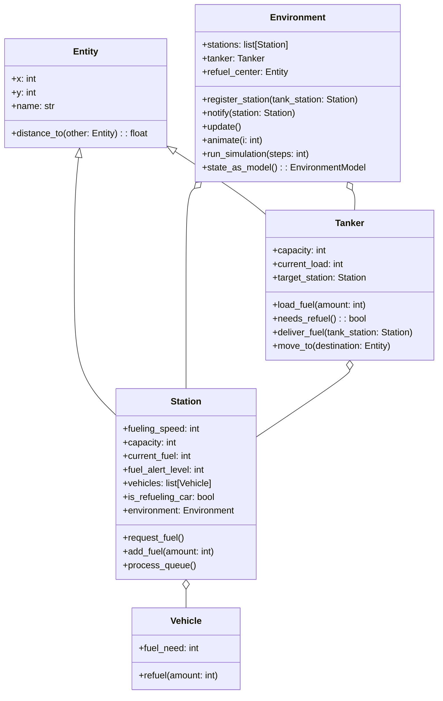

### Gas Station Simulator

### Formal Description of the Gas Station Refueling Simulation

**Overview:**

The gas station refueling simulation models a dynamic system comprising multiple fuel stations, a central refueling center, and a tanker that manages fuel distribution. The simulation aims to optimize fuel logistics by ensuring that each station maintains sufficient fuel levels to serve incoming vehicles efficiently while minimizing the tanker's travel and operational costs.

**Components of the Simulation:**

1. **Fuel Stations:**
   - Each station is characterized by its geographical coordinates and a specified fuel capacity.
   - Stations have a queue of vehicles, each requiring a certain amount of fuel.
   - Stations monitor their fuel levels and request refueling from the tanker when the fuel level drops below a specified threshold.

2. **Tanker:**
   - The tanker is tasked with refueling stations from a central refuel center.
   - It has a finite fuel capacity and must return to the refuel center to replenish its own fuel supply, especially when its load falls below 20% of its capacity.
   - The tanker follows a designated route to deliver fuel efficiently to the stations in need. It can service only one station at a time and will ignore new requests while en route.

3. **Refuel Center:**
   - Located centrally within the simulation area, the refuel center maintains an infinite supply of fuel.
   - It serves as the primary source from which the tanker refills its fuel load.

**Operational Dynamics:**

- The simulation progresses in discrete steps. Each step involves the tanker moving towards its target, delivering fuel, or returning to the refuel center for refueling.
- Fuel stations process their vehicle queues continuously, providing fuel to vehicles based on availability and queue priority.
- Upon reaching critical fuel levels, stations send a refueling request to the tanker. If the tanker is available (not servicing another station or en route), it will set the requesting station as its next target.
- If the tanker’s fuel load is critically low, it prioritizes returning to the refuel center over responding to station requests.

**Objective:**

The primary objective of the simulation is to manage fuel logistics efficiently. This includes:
- Minimizing the waiting time for vehicles at fuel stations.
- Reducing the travel distance and time of the tanker, thus saving on fuel costs and improving service efficiency.
- Ensuring that no station runs out of fuel, which could disrupt service and affect customer satisfaction.

**Metrics for Evaluation:**

- Average waiting time per vehicle across all stations.
- Total fuel delivered by the tanker versus the fuel consumed in travel.
and return trips to the refuel center.
- Frequency of stations running out of fuel.

This simulation provides valuable insights into the logistics of fuel management in a controlled environment, allowing for strategic planning and operational adjustments to enhance real-world fuel distribution networks.

## Architecture

